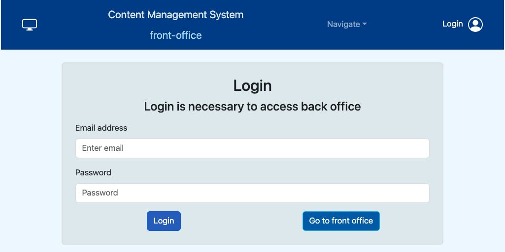
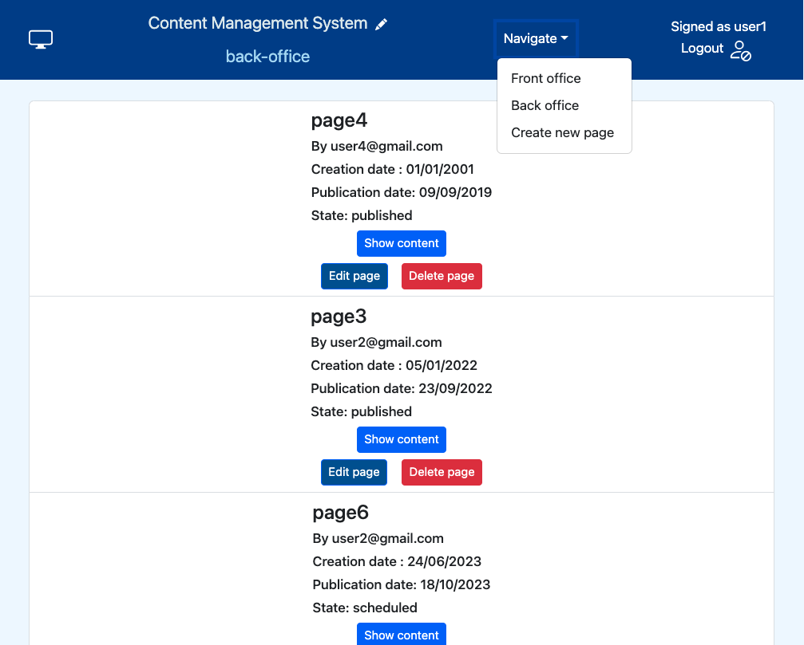
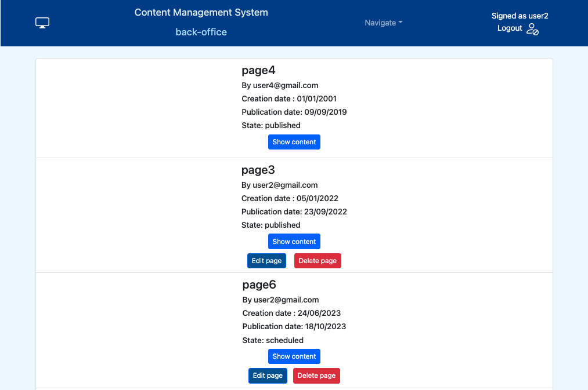
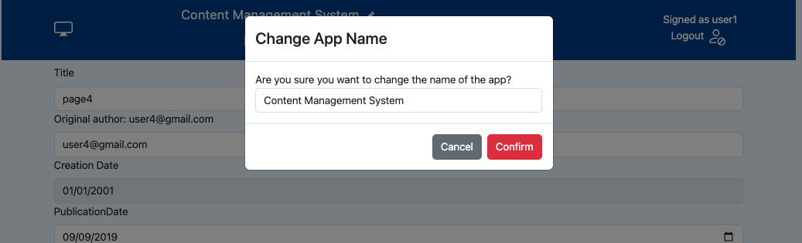

[](https://classroom.github.com/a/_XpznRuT)
# Exam #1: "CMSmall"

## Student: s309685 Cacopardi Giorgio 

# Server side

## API Server

### Authenitcated API

- DELETE `/logout` (api to perform the logout from the session)
  
  - request parameters and request body: none
  - response body content for authenitcated user:
  ```json
  {
    "result": "logout executed"
  } 
  ```
  - response body content for non authenitcated user:
  ```json
  {
    "error": "NOT AUTHENTICATED - GO AWAY"
  }
  ```
- POST `/page/` (api to create and add a new page)
  content-type: application/json
  - request parameters: none
  - request body:
   ```json
  {
    "title" : "page title",
    "author" : "user1@gmail.com",
    "creationDate" : "01/01/2011",
    "publicationDate" : "",
    "contents" : [
        {
            "type": "header",
            "content": "prova header",
            "position" : 1
        },
        {
            "type": "image",
            "content": "piramide.jpg",
            "position" : 2
        } 
    ]
  }
  ```
  - response body content for correct request:
    
  ```json
  {
     "message": "page inserted correctly with its content"
  } 
   ```
  - response body content for incorrect request:
  ```json
  {
    "error": "the type of the content is not valid"
  }
  ```
- PUT `/page/:id` (api to modify an existing page)
  
  content-type: application/json
  - request parameters: id of the page to modify
  - request body:
  ```json
  {
    "title" : "page title",
    "author" : "user1@gmail.com",
    "creationDate" : "01/01/2011",
    "publicationDate" : "",
    "contents" : [
        {
            "type": "header",
            "content": "prova header",
            "position" : 1
        },
        {
            "type": "image",
            "content": "piramide.jpg",
            "position" : 2
        } 
    ]
  }
  ```
  - response body content for correct request:
  ```json
  {
     "message": "page modified correctly"
  } 
  ```
  - response bodies content for incorrect requests:

  -for error about missing content or invalid date
  ```json
  {
    "error": "error description"
  }
  ```
  -for validation error like title length or contents number
  ```json
  {
    "errors": [
        {
            "type": "field",
            "value": "a",
            "msg": "Invalid value",
            "path": "id",
            "location": "params"
        }
    ]
  }
  ```
   -for error about operation on the page not valid(like a not admin user who attempts to modify a page of another user)
  ```json
  {
    "error": "user not authorized to perform this operation"
  }
  ```

- DELETE `/page/:id` (api to delete an existing page)
  content-type: application/json
  - request parameters: id of the page to delete
  - request body: none
  - response body content for correct request:
  ```json
  {
    "msg": "page correctly eliminated"
  }
  ```
  - response body content for id not present:
  ```json
  {
    "error": "page not present in the db"
  }
  ```
  -for error about operation on the page not valid(like a not admin user who attempts to delete a page of another user)
  ```json
  {
    "error": "user not authorized to perform this operation"
  }
  ```
- PUT `/site-name` (api to modify the name of a site)
  content-type: application/json
  - request parameters: id of the page to delete
  - request body: 
  ```json
  {
    "siteName": "new name"
  }
  ```
  - response body content for correct request:
  ```json
  {
    "msg": "site name change correctly"
  }
  ```
  - response body content for invalid request like a non admin user who try to modificate the name:
  ```json
  {
    "error": "user not authorized to perform this action"
  }
  ```
  -for db error
  ```json
  {
    "error": "db error"
  }
  ```
### Not Authenitcated API

- POST `/login` (api to perform the login)
  
  content-type: application/json
  - request body content :
  ```json
  {
    "username" : "user1@gmail.com",
    "password" : "password"
  }
  ```
  - response body content for correct credentials:
  ```json
  {
    "username": "user1@gmail.com",
    "role": "admin",
    "nickname": "user1" 
  } 
  ```
  - response body content for wrong credentials:
    status 401, Unauthorized
- GET `/page/all` (api to retrieve all the pages available)
  - in the case of an authenitcated user it returns all the pages
  - in the case of a non authenitcated user it returns only the published pages
  
  content-type: application/json
  
  - request parameters and request body content: none
    
  - response body content :
  ```json
  [
    {
        "id": 4,
        "title": "page4",
        "author": "user4@gmail.com",
        "creationDate": "2000-12-31T23:00:00.000Z",
        "publicationDate": "2019-09-08T22:00:00.000Z",
        "type": "published",
        "contents": [
            {
                "id": 152,
                "type": "header",
                "content": "Et harum quidem rerum facilis est et expedita distinctio",
                "position": 0
            },
            {
                "id": 153,
                "type": "image",
                "content": "piramide.jpg",
                "position": 1
            }
        ]
    },
    {
        "id": 3,
        "title": "page3",
        "author": "user2@gmail.com",
        "creationDate": "2022-01-04T23:00:00.000Z",
        "publicationDate": "2022-09-22T22:00:00.000Z",
        "type": "published",
        "contents": [
            {
                "id": 76,
                "type": "header",
                "content": "At vero eos et accusamus et iusto odio dignissimos ducimus qui blanditiis praesentium voluptatum deleniti atque corrupti quos dolores et quas molestias excepturi sint occaecati cupiditate non provident, similique sunt in culpa qui officia deserunt mollitia animi, id est laborum et dolorum fuga",
                "position": 1
            },
            {
                "id": 77,
                "type": "image",
                "content": "mare.jpg",
                "position": 2
            },
            {
                "id": 78,
                "type": "image",
                "content": "canoa.jpg",
                "position": 3
            }
        ]
    }
  ]
  ```
  - response body content in case some errors occurs (typically db ERROR):
    
    status 500
    ```json
    {
      "error" : "an error occurred",
      "content" : "error description"
    }
    ```
- GET `/users` (api to get all the users present)
  
  content-type: application/json
  - request parameters: none
  - request body: none
  - response body content for correct request:
  ```json
  [
    "user1@gmail.com",
    "user2@gmail.com",
    "user3@gmail.com",
    "user4@gmail.com"
  ]
  ```
  -for db error
  ```json
  {
    "error": "errror in retrieving the users"
  }
  ```
- GET `/site-name` (api to get the name of the site)
  content-type: application/json
  - request parameters: none
  - request body: none
  - response body content for correct request:
  ```json
  "Content Management System"
  ```
  -for db error
  ```json
  {
    "error" : "Cannot connect to db"
  }
  ```
## Database Tables

- Table `USERS` - contains the fields: id, username, password (encrypted), salt, nickname, role
- Table `PAGES` - contains the fields: author, creationDate, publicationDate, title, id
  - the 'author' field has a key reference with the username field of the `USERS` table 
- Table `BLOCKS` - contains the fields: id, page, type, content, position
  - the 'page' field has a key reference with the id field of the `PAGES` table
  - in the case of an image type, the content contains the name of the image like "mare.jpg"
- Table `WEB_SITE_NAME` - contains the fields: id, name
  - the table has only one row for memorize the name of the website

# Client side


## React Client Application Routes

### Routes not requiring authenitcation
- Route `/`: contains the HomePageComponent, has the purpose to welcome the user and make him choose between 2 different options. It displays 2 buttons to navigate in different sections: to the front office or, depending if the user is authenitcated or not, to the login or the back office page
- Route `/front`: contains the PagesListComponent that display all the published pages and has the purpose of representing the fron office
- Route `/login`: contains the LoginComponent that has the purpose to login the user
representing the fron office

### Routes requiring authenitcation
#### If a user try to access this protected routes without authenitcation, it is been redirect to the NotAuthorizedComponent
- Route `/logout`: contains the LogoutComponent that has the purpose to logout the user
- Route `/back/pages`: contains the PagesListComponent that display all the pages for authenitcated user and has the purpose of show and modify the pages
- Route `/back/edit/:id`: contains the EditPageComponent that has the purpose of modify a page
- Route `/back/new`: contains the EditPageComponent that has the purpose of create a page
- Route `*`: contains the NotFoundComponent that has the purpose to alert the user that the route he searched did not exist and shows 2 buttons to navigate in different sections: to the front office or, depending if the user is authenitcated or not, to the login or the back office page


## Main React Components

- `HomePageComponent` (in `/componets/HomePageComponent.jsx`): has the purpose to welcome the user and give to it the possibiity of navigate to the front office and, depending if it is already authenitcated or not, to the login page or back-office page with the list of all pages
- `PagesListComponent` (in `/componets/PagesListComponent.jsx`): it is a parametric component:
  - if it is accessed from the '/front' route, it show only the list of the published page, instead if it is access from the protected '/back/pages' route, it show all the pages for the authenticated user
- `LoginComponent` (in `/componets/LoginComponent.jsx`): it has the purpose to authenitcate a user, it consists of a form with 2 fields, a username and a password, and in case of succesfull authentication, it redirect the user. to the '/back/pages' route
- `LogoutComponent` (in `/componets/LogoutComponent.jsx`): it has the purpose to logout a user, it is a component that when accessed show a modal that ask if the user is sure of make a logout. If the user click confirm, it redirect the user to the login page, on the other case, it redirect the user to the previous page
- `EditPageComponent` (in `/componets/EditPageComponent.jsx`): it is a parametric component:
  - if it receives as location state data a page and stands in the route "/back/edit/:id", it display the page and allow the user to edit it, modifying title, author in case of admin user, add or remove content, and change the order of them
  - if it not receives a page and it is in the route "/back/new", it just show an empty form and allow a user to create a new page
- `PageComponent` (in `/componets/PageComponent.jsx`): it has the purpose of show a single page with its content and depending on the user, if it is authenticated or not and if it is admin or not, show also some buttons to edit or delete the page
- `NavigationBar` (in `/componets/NavigationBar.jsx`): it represent the navbar of the site and has the purpose of show some navigation options
  - if the user is not authenticated, it show the link to the login and the link to the fron office
  - if the user is authenticated but not admin it show also the links to create a new page and to the back office and instead of the login link, the logout link
  - if the user is also an admin one, it also give the possibility to modify the site name
    

# Usage info

## Example Screenshot

### Login

### Front office

### Back office - pages list with admin user logged

### Back office - pages list with normal user logged

### Back office - edit page

### Back office - create page

### Back office - change site name

### Not authorized 

### Not found 

### Logout


## Users Credentials
### User1
- username: user1@gmail.com, password: pdfg456ty2, role: admin, nickname: user1
### User2
- username: user2@gmail.com, password:  qd13e23dx, role: user, nickname: user2
### User3
- username: user3@gmail.com, password: 3jkn4tui3h53992, role: user, nickname: user3 
### User4
- username: user4@gmail.com, password: jbru4734f3u, role: admin, nickname: user4
